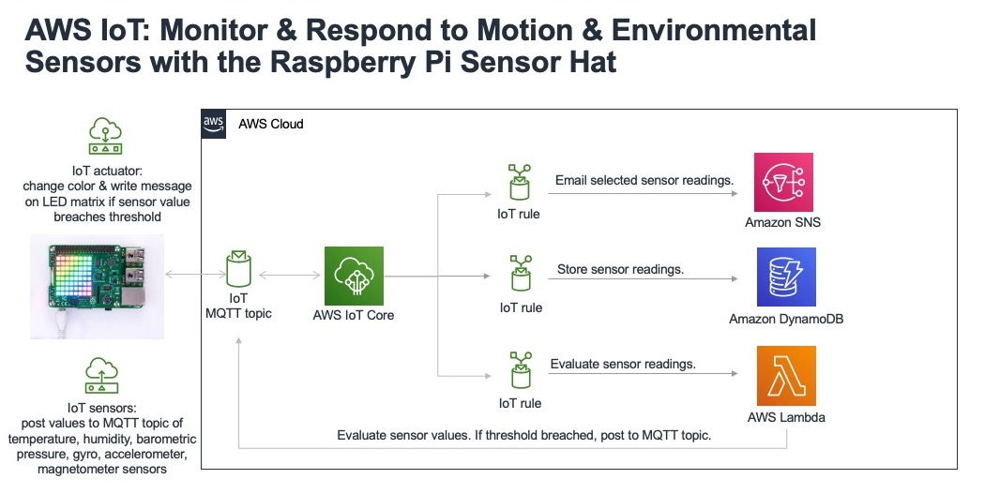

# AWS IoT Raspberry Pi Sensors


> Monitor and control a Raspberry Pi over the internet using AWS IoT Core, MQTT, and environmental sensors from the Raspberry Pi Sense HAT.

[](https://www.youtube.com/watch?v=f7IWtVbQ5dQ)

---

## Overview

Sensor readings from the Raspberry Pi Sense HAT are published over WiFi via MQTT to AWS IoT Core. An IoT Rule routes the data to **Amazon SNS**, **DynamoDB**, and **AWS Lambda**. Lambda evaluates readings against configurable thresholds and publishes control commands back to the device in real time.

## AWS Architecture



---

## Tech Stack

| Layer | Technology |
|---|---|
| Device | Raspberry Pi + Sense HAT |
| Protocol | MQTT |
| Cloud Broker | AWS IoT Core |
| Rules Engine | AWS IoT Rules |
| Compute | AWS Lambda |
| Notifications | Amazon SNS |
| Storage | Amazon DynamoDB |
| Language | Python 3 |

---

## MQTT Payload

Each message published by the device contains:

| Field | Description | Example |
|---|---|---|
| `SENSOR_TYPE` | Type of sensor reading | `TEMP`, `HUMIDITY`, `PRESSURE` |
| `VALUE` | Recorded sensor value | `23.4` |
| `NOW` | ISO datetime of the reading | `2024-01-15T12:00:00` |
| `NODE_ID` | Unique device serial number | `abc123xyz` |

---

## About AWS IoT Core

AWS IoT Core can support **billions of devices** and route **trillions of messages**, connecting physical sensors to the cloud without provisioning custom infrastructure. Its built-in Rules Engine lets incoming MQTT messages trigger serverless workflows, filter data for analytics, and store historical state — seamlessly integrated with the broader AWS ecosystem.

---

## Project Files

| File | Description |
|---|---|
| `aws-iot-test01.py` | Test local Sense HAT behavior — prints sensor readings and drives the LED matrix |
| `basicPubSub.py` | Main script — connects to AWS IoT, publishes sensor data, and receives control commands |
| `IoTLambdaSensorResponse.py` | Lambda function — evaluates data, triggers SNS alerts on threshold breaches, and publishes commands back to the device |

---

## Prerequisites

- **Python 3.x**
- **Sense HAT Library** (on Raspberry Pi):
  ```bash
  sudo apt-get update && sudo apt-get install sense-hat
  ```
- **AWS IoT Python SDK v1** — [installation guide](https://docs.aws.amazon.com/greengrass/latest/developerguide/IoT-SDK.html)
- An **AWS Account** with IoT Core access

---

## Setup

### 1. AWS Side

1. Create a **Lambda function** using `IoTLambdaSensorResponse.py` as the baseline.
2. Update the `TopicArn` to point to your SNS Topic ARN.
3. Update the region in `boto3.client` calls if you are not using `us-east-1`.
4. Attach an **IAM Execution Role** with these permissions:

   | Permission | Service |
   |---|---|
   | `sns:Publish` | Amazon SNS |
   | `iot:Publish` | AWS IoT Core |

### 2. Raspberry Pi Side

1. Register a **Thing** in the AWS IoT Core console and download:
   - Certificate (`.pem.crt`)
   - Private Key (`-private.pem.key`)
   - Root CA

2. Note your **AWS IoT endpoint** from the IoT Core console.

---

## Usage

**Test local sensors:**
```bash
python3 aws-iot-test01.py
```

**Run the full IoT pipeline:**
```bash
python3 basicPubSub.py \
  -e <your-iot-endpoint>.amazonaws.com \
  -r <root-CA-file> \
  -c <certificate-file> \
  -k <private-key-file>
```

---

## Hardware

- [Raspberry Pi](https://www.raspberrypi.org/) — WiFi-enabled single-board computer
- [Raspberry Pi Sense HAT](https://www.raspberrypi.org/products/sense-hat/) — gyroscope, accelerometer, magnetometer, temperature, barometric pressure, humidity sensors + LED matrix
